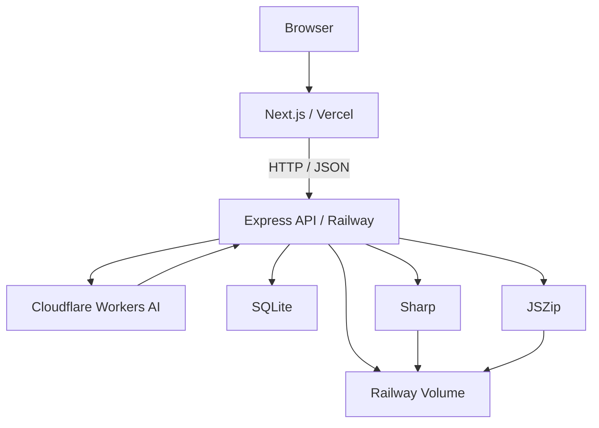

# LP Generator

AIを利用してランディングページのイメージを生成し、そのデザイン要素を素材シートとして再構成、分割、透過PNG化し、ZIPとして出力するWebアプリケーションです。

本プロジェクトは、アクティブラーナー「AIを活用した公開Web APIの設計・開発と課題解決への応用」の成果物として制作しました。

---

## 公開URL

### Web Application

https://lp-generator-kappa.vercel.app

### API

https://lp-generator-production-ce78.up.railway.app

---

## 背景と目的

Webサイトやランディングページを制作する際、AIによって完成イメージを生成することは比較的容易になっています。

一方で、生成された1枚の画像を実際のWeb制作で利用するには、

- 画像内の素材を個別に準備する
- 各素材を切り出す
- 背景を除去する
- ファイルとして整理する

といった追加作業が必要です。

そこで本プロジェクトでは、

> AIでLPの完成イメージを生成するだけでなく、そのデザインを後から利用できる素材として再構成・出力する

ことを目的としました。

また、単なるAI APIの利用ではなく、自作したREST APIを介してAI、画像処理、データ保存などの処理を組み合わせています。

---

# 主な機能

1. サービス情報を入力
2. AIによるLPイメージ生成
3. LPに対応した4×4の素材シート生成
4. 素材シートを16セルに分割
5. 各セルをPNGファイルとして切り出し
6. 白に近い背景を簡易的に透過
7. 16個のPNG素材をZIPへまとめる
8. Web上で生成結果をプレビュー・ダウンロード

---

# 処理フロー

```text
ユーザーがサービス情報を入力
        ↓
POST /projects
プロジェクト作成・アクセストークン発行
        ↓
POST /projects/:id/lp-images
Cloudflare Workers AIでLP画像を生成
        ↓
POST /projects/:id/asset-sheets
4×4素材シートを生成
        ↓
POST /grid-splits
各セルの座標を計算
        ↓
POST /projects/:id/asset-exports
Sharpで16枚に分割・簡易透過
        ↓
JSZipでZIPを生成
        ↓
Web上でプレビュー・ダウンロード
```

---

# システム構成



ブラウザからCloudflare Workers AIを直接呼び出すのではなく、Express APIを経由しています。

これにより、Cloudflare API Tokenをフロントエンドへ公開せずに利用できます。

---

# 使用技術

## Frontend

- Next.js
- React
- TypeScript
- Vercel

## Backend

- Node.js 22
- Express
- JavaScript
- Railway

## Database / Storage

- SQLite (`node:sqlite`)
- Railway Volume

## AI / Image Processing

- Cloudflare Workers AI
- FLUX.2 [klein] 9B
- Sharp
- JSZip

## Development

- Git
- GitHub
- Postman
- Chrome DevTools

---

# ディレクトリ構成

```text
lp-generator/
├── api/
│   ├── index.js
│   ├── package.json
│   └── src/
│       ├── app.js
│       │
│       ├── config/
│       │   └── paths.js
│       │
│       ├── database/
│       │   └── database.js
│       │
│       ├── middleware/
│       │   └── requireProjectAccess.js
│       │
│       ├── prompts/
│       │   ├── lpPrompt.js
│       │   └── assetSheetPrompt.js
│       │
│       ├── routes/
│       │   ├── projectRoutes.js
│       │   ├── gridRoutes.js
│       │   └── devRoutes.js
│       │
│       ├── security/
│       │   └── projectToken.js
│       │
│       ├── services/
│       │   ├── cloudflareImageService.js
│       │   ├── gridService.js
│       │   ├── assetExportService.js
│       │   └── zipService.js
│       │
│       ├── store/
│       │   └── projectStore.js
│       │
│       └── utils/
│           └── apiResponse.js
│
├── web/
│   ├── app/
│   │   └── page.tsx
│   │
│   ├── components/
│   │   ├── AssetSheetPreview.tsx
│   │   ├── ExportPanel.tsx
│   │   ├── ExportedAssetGrid.tsx
│   │   ├── PreviewCard.tsx
│   │   ├── ProjectForm.tsx
│   │   ├── SplitResult.tsx
│   │   ├── StatusDisplay.tsx
│   │   └── styles.ts
│   │
│   ├── lib/
│   │   └── api.ts
│   │
│   └── types/
│       └── api.ts
│
└── README.md
```

---

# バックエンドの責務分割

初期実装では、ルーティング、AI通信、画像処理、ZIP生成、データ管理などの処理をすべて`index.js`に記述していました。

現在は処理の責務ごとに分割しています。

| ディレクトリ | 役割 |
|---|---|
| `routes` | HTTPリクエスト・レスポンス |
| `services` | AI、画像、ZIPなどの実処理 |
| `store` | プロジェクトデータの保存・取得・更新 |
| `database` | SQLite接続・テーブル管理 |
| `middleware` | 共通の認可処理 |
| `security` | アクセストークン生成・検証 |
| `prompts` | AI用プロンプト生成 |
| `config` | 保存パスなどの設定 |
| `utils` | APIレスポンスなどの共通処理 |

`index.js`は現在、環境変数の読み込みとExpressサーバーの起動のみを担当します。

---

# フロントエンドの責務分割

初期実装では、フォーム、API通信、プレビュー、素材一覧などを1つの`page.tsx`に記述していました。

現在はUIをコンポーネントごとに分割しています。

`page.tsx`は、

- ページ全体のstate
- APIの実行順序
- 各コンポーネントの接続

を主に担当します。

APIレスポンス解析は`lib/api.ts`、共有TypeScript型は`types/api.ts`へ分離しています。

---

# API設計

Base URL:

```text
https://lp-generator-production-ce78.up.railway.app
```

## 共通レスポンス形式

### 成功

```json
{
  "success": true,
  "data": {},
  "error": null
}
```

### 失敗

```json
{
  "success": false,
  "data": null,
  "error": {
    "code": "ERROR_CODE",
    "message": "Error message.",
    "details": {}
  }
}
```

存在しないルートについても、共通JSON形式の404レスポンスを返します。

---

# API一覧

| Method | Endpoint | 説明 | Token |
|---|---|---|---|
| GET | `/` | API動作確認 | 不要 |
| POST | `/projects` | プロジェクト作成 | 不要 |
| GET | `/projects/:id` | プロジェクト取得 | 必要 |
| POST | `/projects/:id/lp-images` | LP画像生成 | 必要 |
| POST | `/projects/:id/asset-sheets` | 素材シート生成 | 必要 |
| POST | `/grid-splits` | グリッド座標計算 | 不要 |
| POST | `/projects/:id/asset-exports` | PNG・ZIP出力 | 必要 |

`GET /projects`は開発環境のみ利用可能で、本番環境では公開していません。

---

# POST `/projects`

新しいプロジェクトを作成します。

## Request

```json
{
  "serviceName": "aiment",
  "concept": "A service where Japanese learners can practice conversation in a fun and natural way.",
  "targetUser": "International Japanese learners who want speaking practice.",
  "tone": "modern, soft, futuristic, clean",
  "mainMessage": "Learn Japanese by speaking, not just studying."
}
```

`concept`と`targetUser`は必須です。

## Response

```json
{
  "success": true,
  "data": {
    "id": 1,
    "serviceName": "aiment",
    "concept": "...",
    "targetUser": "...",
    "accessToken": "PROJECT_ACCESS_TOKEN"
  },
  "error": null
}
```

`accessToken`はプロジェクト作成時にのみ返されます。

---

# プロジェクトアクセストークン

プロジェクト固有APIでは、HTTPヘッダーにアクセストークンを指定します。

```http
X-Project-Token: PROJECT_ACCESS_TOKEN
```

例：

```bash
curl \
  https://lp-generator-production-ce78.up.railway.app/projects/1 \
  -H "X-Project-Token: PROJECT_ACCESS_TOKEN"
```

## トークンなし

```text
401 Unauthorized
```

```json
{
  "success": false,
  "data": null,
  "error": {
    "code": "PROJECT_TOKEN_REQUIRED",
    "message": "X-Project-Token header is required.",
    "details": null
  }
}
```

## 不正なトークン

```text
404 Not Found
```

```json
{
  "success": false,
  "data": null,
  "error": {
    "code": "PROJECT_NOT_FOUND",
    "message": "Project not found.",
    "details": null
  }
}
```

不正なトークンの場合、プロジェクトが実際に存在するかどうかを外部へ通知しない設計にしています。

---

# アクセストークンの安全性

アクセストークンは、

```text
POST /projects
↓
ランダムなトークンを生成
↓
生のトークンをクライアントへ一度だけ返す
↓
SHA-256でハッシュ化
↓
SQLiteにはハッシュのみ保存
```

という流れで管理します。

フロントエンドでは、生のトークンを生成処理中のローカル変数としてのみ保持しています。

以下には保存しません。

- React state
- localStorage
- sessionStorage
- Cookie
- URL
- console
- SQLiteの平文データ

プロジェクト固有の3つの処理にのみ`X-Project-Token`を送信します。

---

# POST `/projects/:id/lp-images`

プロジェクトのプロンプトを利用してLP画像を生成します。

```http
POST /projects/1/lp-images
X-Project-Token: PROJECT_ACCESS_TOKEN
```

Cloudflare Workers AIで画像を生成し、生成画像を保存します。

レスポンスには、

- 画像URL
- 使用モデル
- プロンプト
- 生成日時

などをJSON形式で返します。

---

# POST `/projects/:id/asset-sheets`

LP画像生成後に、同じプロジェクト情報から4×4の素材シートを生成します。

```http
POST /projects/1/asset-sheets
X-Project-Token: PROJECT_ACCESS_TOKEN
```

素材シートでは、各セルに1つのUI素材が入るようプロンプトを設計しています。

---

# POST `/grid-splits`

指定した画像をグリッドへ分割した場合の座標情報を計算します。

このAPIは画像そのものを加工せず、各セルの座標をJSONとして返します。

## Request

```json
{
  "imageUrl": "https://example.com/image.png",
  "imageWidth": 1024,
  "imageHeight": 1024,
  "rows": 4,
  "cols": 4
}
```

## Response

```json
{
  "success": true,
  "data": {
    "grid": {
      "rows": 4,
      "cols": 4,
      "imageWidth": 1024,
      "imageHeight": 1024,
      "cellWidth": 256,
      "cellHeight": 256
    },
    "cells": [
      {
        "id": "r1c1",
        "row": 1,
        "col": 1,
        "x": 0,
        "y": 0,
        "width": 256,
        "height": 256
      }
    ]
  },
  "error": null
}
```

---

# POST `/projects/:id/asset-exports`

素材シートを16個のPNG画像へ切り出し、簡易透過処理を行い、ZIPとして出力します。

```http
POST /projects/1/asset-exports
X-Project-Token: PROJECT_ACCESS_TOKEN
```

処理：

```text
素材シート
↓
Sharpで4×4に分割
↓
各セルをPNG保存
↓
白に近い背景を透明化
↓
JSZipで16ファイルをZIP化
↓
画像URL・ZIP URLをJSONで返す
```

---

# データ永続化

初期実装では、

```js
const projects = [];
```

のようにNode.jsのメモリ上へプロジェクト情報を保存していました。

この方式では、Railwayの再起動・再デプロイ時にデータが失われます。

現在はSQLiteを使用しています。

```text
Express
↓
projectStore.js
↓
SQLite
↓
/data/lp-generator.sqlite
```

本番環境ではSQLiteファイルをRailway Volumeの`/data`へ保存します。

そのため、Railwayを再デプロイしてもプロジェクト情報が保持されます。

実際に、

1. プロジェクトを作成
2. Railwayを再デプロイ
3. 同じIDを取得
4. 生成画像・素材情報・ZIP情報が残っていることを確認
5. 新規プロジェクトIDが続きから採番されることを確認

しています。

---

# ファイル保存

本番環境ではRailway Volumeを使用しています。

```text
/data/
├── lp-generator.sqlite
├── generated/
├── assets/
└── exports/
```

- `generated/`: AI生成画像
- `assets/`: 分割・透過したPNG
- `exports/`: ZIPファイル
- `lp-generator.sqlite`: プロジェクト情報

---

# CORS

フロントエンドとバックエンドを、

- Vercel
- Railway

へ分離しているため、Express側でCORSを設定しています。

許可するOriginは環境変数`ALLOWED_ORIGINS`から管理します。

また、プロジェクト認可用のカスタムヘッダー、

```text
X-Project-Token
```

もCORSの許可対象に設定しています。

---

# エラー処理

主なエラーコード：

| Code | 内容 |
|---|---|
| `MISSING_FIELD` | 必須入力が不足 |
| `INVALID_INPUT` | 入力値が不正 |
| `INVALID_GRID_SIZE` | グリッドサイズが不正 |
| `PROJECT_NOT_FOUND` | プロジェクトが存在しない、または認可失敗 |
| `PROJECT_TOKEN_REQUIRED` | アクセストークンがない |
| `IMAGE_NOT_GENERATED` | LP画像が未生成 |
| `ASSET_SHEET_NOT_GENERATED` | 素材シートが未生成 |
| `CONFIG_ERROR` | 必要な環境変数がない |
| `CLOUDFLARE_AI_ERROR` | AI APIの呼び出し失敗 |
| `CLOUDFLARE_RESPONSE_ERROR` | AI APIレスポンス形式が不正 |
| `ROUTE_NOT_FOUND` | APIルートが存在しない |
| `INTERNAL_SERVER_ERROR` | サーバー内部エラー |

すべて、

```json
{
  "success": false,
  "data": null,
  "error": {}
}
```

という共通形式で扱います。

---

# フロントエンドでのAPIレスポンス検証

フロントエンドではAPIレスポンスをそのまま信用せず、

- JSONとして解析できるか
- `ApiResult`の構造になっているか
- `success`がbooleanか
- HTTPステータスと`success`が矛盾していないか

を確認します。

これにより、HTML形式の404ページや不正なJSONを正常レスポンスとして扱わないようにしています。

---

# ローカル環境での実行

## 必要環境

- Node.js 22
- npm
- Cloudflare Account ID
- Cloudflare Workers AI API Token

リポジトリを取得します。

```bash
git clone <YOUR_REPOSITORY_URL>
cd lp-generator
```

---

## API

```bash
cd api
npm install
```

`api/.env`を作成します。

```env
CLOUDFLARE_API_TOKEN=your_token
CLOUDFLARE_ACCOUNT_ID=your_account_id

CF_IMAGE_MODEL=@cf/black-forest-labs/flux-2-klein-9b

BASE_URL=http://localhost:4000

ALLOWED_ORIGINS=http://localhost:3000,http://localhost:3001
```

起動：

```bash
npm start
```

```text
http://localhost:4000
```

ローカルではSQLiteデータベースが、

```text
api/data/lp-generator.sqlite
```

へ保存されます。

---

## Web

別のターミナルを開きます。

```bash
cd web
npm install
```

`web/.env.local`：

```env
NEXT_PUBLIC_API_BASE_URL=http://localhost:4000
```

起動：

```bash
npm run dev
```

```text
http://localhost:3000
```

---

# 本番環境

## Railway

APIをRailwayへデプロイしています。

```text
Root Directory: /api
Start Command: npm start
```

主な環境変数：

```env
CLOUDFLARE_API_TOKEN=...
CLOUDFLARE_ACCOUNT_ID=...
CF_IMAGE_MODEL=@cf/black-forest-labs/flux-2-klein-9b

BASE_URL=https://lp-generator-production-ce78.up.railway.app

STORAGE_DIR=/data
DATABASE_PATH=/data/lp-generator.sqlite

ALLOWED_ORIGINS=https://lp-generator-kappa.vercel.app
```

Railway Volume：

```text
Mount Path: /data
```

---

## Vercel

WebアプリケーションをVercelへデプロイしています。

```text
Root Directory: web
Framework: Next.js
```

環境変数：

```env
NEXT_PUBLIC_API_BASE_URL=https://lp-generator-production-ce78.up.railway.app
```

---

# 設計上の改善

開発途中で、公開APIとしての品質を高めるために以下を改善しました。

## 1. API命名の改善

初期：

```text
POST /generate-lp
```

実際にはLPを生成するのではなく、プロジェクトを作成していました。

改善後：

```text
POST /projects
```

処理内容とAPI名が一致するよう変更しました。

---

## 2. バックエンドの責務分割

初期は`index.js`へほぼすべての処理を書いていました。

現在は、

```text
routes
services
store
database
middleware
security
prompts
config
utils
```

へ分割しました。

---

## 3. データの永続化

初期：

```text
JavaScript配列
```

改善後：

```text
SQLite + Railway Volume
```

再起動・再デプロイ後もデータが残るようになりました。

---

## 4. プロジェクト認可

初期は、

```text
GET /projects/1
GET /projects/2
GET /projects/3
```

のようにIDを変更するだけで別プロジェクトへアクセスできました。

現在は、

```text
Project ID
+
X-Project-Token
```

の両方が必要です。

また、本番環境ではプロジェクト一覧APIを公開していません。

---

## 5. フロントエンドのコンポーネント分割

初期は1つの`page.tsx`へUIの多くを記述していました。

現在はフォーム、ステータス、素材シート、分割結果、ZIP、PNG一覧などをコンポーネントとして分割しています。

---

## 6. APIレスポンス検証

APIがJSON以外を返した場合や、HTTPステータスとレスポンス内容が矛盾した場合を検出できるようにしました。

---

# 現在の制約

## AI生成結果のばらつき

画像生成AIが常に正確な4×4グリッドへ素材を配置するとは限りません。

素材がセル境界をまたぐ、不要な文字が含まれる、といった場合があります。

---

## 背景透過は簡易処理

現在はRGB値が白に近いピクセルを透明化しています。

そのため、素材自体に含まれる白色部分まで透明になる場合があります。

今後は、

- クロマキー方式
- 専用背景除去モデル
- マスク生成

などによる改善が考えられます。

---

## ユーザーアカウント認証ではない

現在の認可はプロジェクト単位のアクセストークン方式です。

ユーザー登録、ログイン、プロジェクト所有者管理などの本格的なアカウント認証は実装していません。

---

## AI APIの利用制限

Cloudflare Workers AI側の利用枠や制限に達した場合、画像生成が失敗する場合があります。

---

# 今後の改善

- ユーザーアカウント認証
- プロジェクト所有者管理
- APIレート制限
- PostgreSQLなどへの移行
- OpenAPI / SwaggerによるAPI仕様公開
- 自動テスト
- AI生成素材のグリッド配置精度向上
- より高精度な背景除去
- 過去プロジェクトをWebから再表示する機能
- 素材ごとの自動命名
- 生成素材を利用したHTML自動構築

---

# 学習したこと

本プロジェクトを通して、以下を学習しました。

- Web APIの基本構造
- REST APIの設計
- HTTPメソッドとURL設計
- JSON形式の入出力
- Expressのルーティング
- Express Middleware
- CORSとPreflight Request
- 外部AI APIとの連携
- API Tokenのサーバー側管理
- プロジェクト単位の認可
- ハッシュを利用したトークン管理
- SQLiteによるデータ永続化
- Prepared Statement
- Railway Volume
- Sharpによる画像処理
- JSZipによるZIP生成
- Next.jsとExpress APIの連携
- TypeScriptによるAPI型定義
- フロントエンドのコンポーネント分割
- APIレスポンスの実行時検証
- Git / GitHubによる変更管理
- Vercel / Railwayへのデプロイ
- ローカル環境と本番環境の違い

---

# 計画から変更した点

当初は外部AI APIとしてGoogle AI Studioを例に想定していましたが、実装ではCloudflare Workers AIを採用しました。

また、当初はAI出力そのものをJSONとして扱う構想でしたが、本システムではAIの主要出力が画像です。

そのため、

```text
AI
↓
画像生成
↓
サーバーへ保存
↓
画像URL・座標・素材一覧などをJSONで返す
```

という設計へ変更しました。

---

# 成果

最終的に、

```text
サービス情報入力
↓
AIによるLP画像生成
↓
素材シート生成
↓
4×4グリッド分割
↓
16個の透過PNG生成
↓
ZIP出力
```

までをWeb上で一連の処理として実行できるシステムを公開しました。

さらに、公開APIとしての品質を高めるため、

- API命名の整理
- バックエンドの責務分割
- フロントエンドのコンポーネント分割
- SQLiteによる永続化
- Railway Volumeによるファイル保存
- プロジェクトアクセストークンによる認可
- 共通JSONエラー形式
- APIレスポンス検証

を実装しました。

# 生成AIの活用について

本プロジェクトの開発では、ChatGPTおよびCodexを学習・開発支援ツールとして使用しました。

主に、API設計や実装方針の検討、コードの雛形・改善案の生成、エラー原因の整理、リファクタリング、READMEの構成・記述支援などに生成AIを活用しています。

生成されたコードや提案はそのまま採用するのではなく、処理内容を確認しながら修正・検証しました。特に、API設計、SQLiteによる永続化、アクセストークンによる認可、バックエンド・フロントエンドの責務分割については、実際に動作確認を行いながら実装しています。

また、個人情報や機密情報を生成AIへ入力せず、AIの出力について最終的な確認・判断を自分で行いました。

---

## Author

永楽 蒼弥